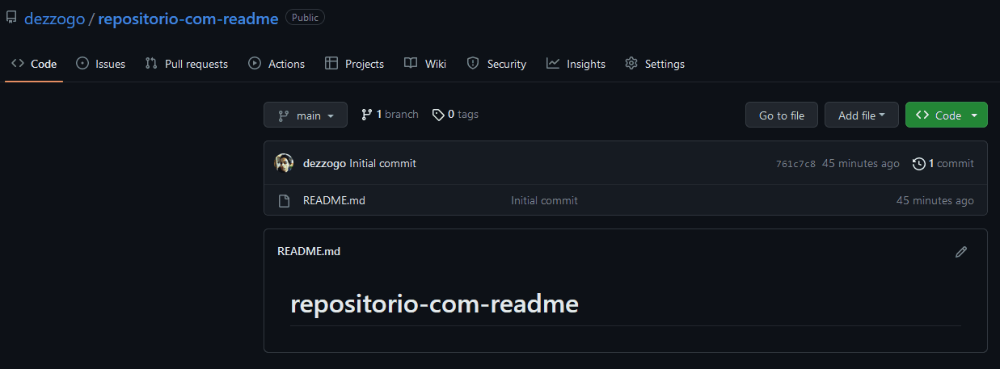

# README teste
Estou testando como funciona um arquivo README. <br>
Essa descrição do projeto não é real, mas vou aprender a melhorar esta página para trabalhos no futuro! 🧙

[]

## Tecnologias utilizadas
- HTML
- CSS
- JS

## Como utilizar

Clone para o projeto<br>
(joga isso aqui no git!)
```
git clone <url>
```

Acesse a pasta do projeto
```
cd repositorio-com-readme
```

### Link bom pra ver mais possibilidades de edição em MD:<br>
<a href="(https://github.com/adam-p/markdown-here/wiki/Markdown-Cheatsheet)">Markdown Cheatsheet</a>
